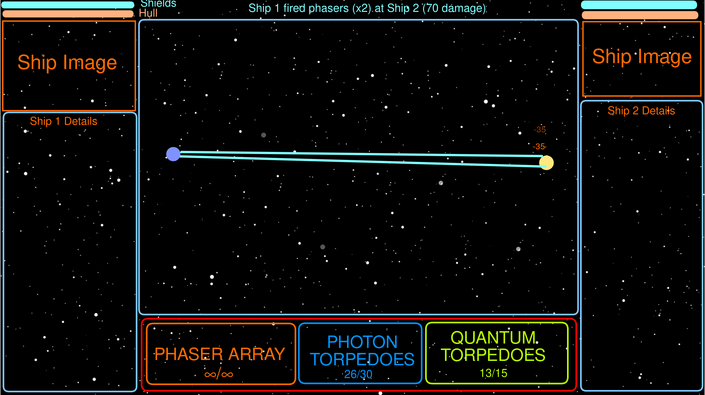
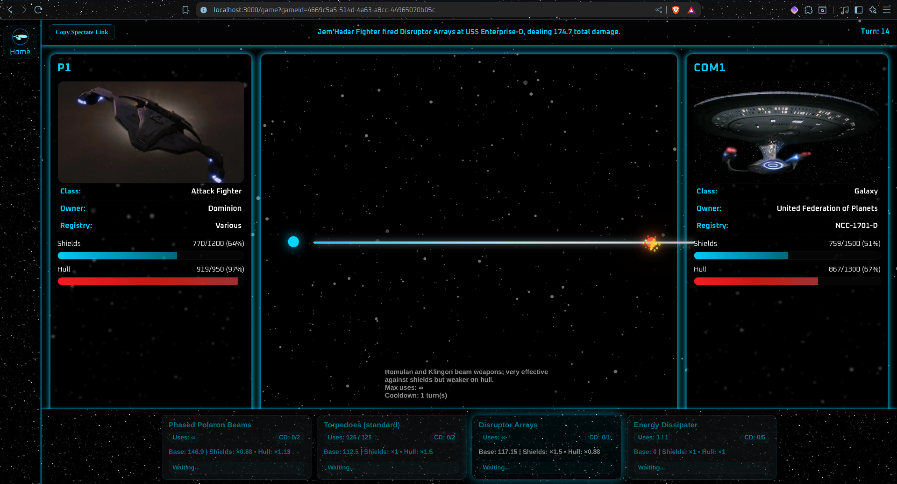

- What is it your are going to build and how does it fit the theme?
  - We are building a Star Trek epic space battle simulator and, as part of it, a but of a custom Star Trek starship database. This fits the theme because Star Trek is a T.V. Show (and has several movies) and we're using data that's as close to canon as possible.
- What tools will you use?
  - Postgresql
  - Express.js
  - Python and JavaScript for developer scripts like ETL and mass image downloading
  - Socket.IO for Web Sockets
  - Data sources like STAPI and Memory Alpha
  - WebStorm's automatic UML Documentation generator
  - CSV to input data for the database and ETL scripts to move it to an SQL database
  - A lot of music (how else are we supposed to focus?)
  - Render.com to host the website for all to see
  - Unit testing
  - Request logging
  - Custom-made DebugMode usable with env var `DEBUG=true`
  - and more
- How long do you expect to spend on development of each part?
  - Depends on each part but anywhere from a few hours to a few days
  - To list a few features:
  - Scraping data (and manually inputting/editing data into CSV files)
    - Expected: 2-5 days
    - Actual: ~5-8 days
  - Game Engine
    - Expected: 5-8 days
    - Actual: ~6-7 days
  - Front End UI
    - Expected: 1-2 days
    - Actual: ~5-8 days
  - API (interfaces with database)
    - Expected: ~5-9 days
    - Actual: that's kind of a gray area. Not sure tbh

### Plan for the battle page (*game.html*):

###### Does this count as my wireframes?

**And for reference...**
### Actual battle page result:

###### Well, almost final result anyway. There's at least 3 minor visual bugs present in this screenshot.